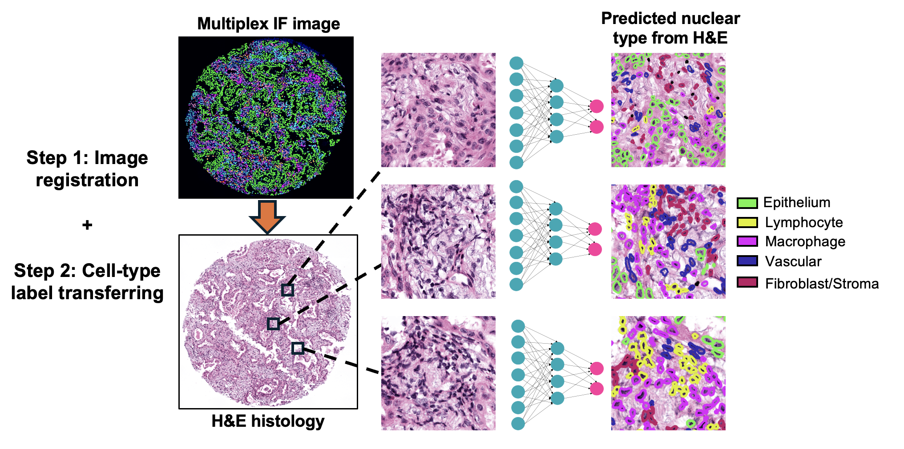

# NucSegAI

## Introduction

NucSegAI is a deep learning model for automated nuclear segmentation and cell-type classification in H&E-stained histology images. NucSegAI is based on the HoverNet backbone, and is trained on H&E-stained images with paired multiplex immunofluorescence imaging data. 

Instruction for use: https://github.com/gevaertlab/NucSegAI

## Why NucSegAI

Existing deep-learning models for nuclear segmentation and cell-type classification are mostly trained on human-annotated H&E images, with performance often constrained by the limited number of labeled instances. Moreover, intra- and inter-observer variability in manual annotations can further hinder model accuracy. In contrast, **NucSegAI** is trained on large-scale H&E-stained images paired with multiplex immunofluorescence (mIF) data, where cell types are objectively defined based on the expression of lineage-specific markers, providing more reliable supervision.

## Class labels

0: Undefined \
1: Epithelium (PD-L1 low and Ki67 low) \
2: Epithelium (PD-L1 hi or Ki67 hi) \
3: Macrophage \
4: Lymphocyte \
5: Vascular \
6: Fibroblast/Stroma

## Environment setup

1. Create a new conda environment: `conda create -n nucsegai python=3.9`
2. Activate the environment: `conda activate nucsegai`
3. Install the library requirements for HoverNet: `pip install src_hovernet/requirements.txt`
4. Install the stain-tools: `pip install staintools`

## Image preparation

1. Images can be either patches/tiles in `.tiff` or whole-slide images (WSI) in `.svs`. 

2. Images are assumed to be captured at 40X magnification, with a resolution of 0.25 um/pixel. Improper resolution will generate suboptimal results. 

2. During model development, we found staining normalization is critical for generating accurate results. Images must be stain normalized before applying the model:

- `python3 stain_norm.py`

## Inference

1. Download the model weights from the [HuggingFace](https://huggingface.co/OGevaertLab/NucSegAI/).

- Colorectal cancer: NucSegAI_CRC.tar
- Non-small-cell lung cancer: NucSegAI_NSCLC.tar 

2. Place the tar file(s) into a `model_bin/` folder under the same directory with this repo. 

3. Run `src_hovernet/run_tile.sh` for tile inference or `src_hovernet/run_wsi.sh` for WSI inference. 

## Relevant repositories: 

- StainTools: https://github.com/Peter554/StainTools 
- HoverNet: https://github.com/vqdang/hover_net

## Citation

Zheng Y et al., Single-cell multimodal analysis reveals tumor microenvironment predictive of treatment response in non–small cell lung cancer.Sci. Adv.11,eadu2151(2025).DOI:10.1126/sciadv.adu2151

## License

These models are released under the **CC-BY-NC-ND 4.0** license and may only be used for non-commercial, academic research purposes with proper attribution. Any commercial use, sale, or other monetization of the models and their derivatives, which include models trained on outputs from the model is prohibited and requires prior approval. Downloading the model requires prior registration on Hugging Face and agreeing to the terms of use. By downloading this model, you agree not to distribute, publish or reproduce a copy of the model. If another user within your organization wishes to use the model, they must register as an individual user and agree to comply with the terms of use. If you are a commercial entity, please contact the corresponding author.

